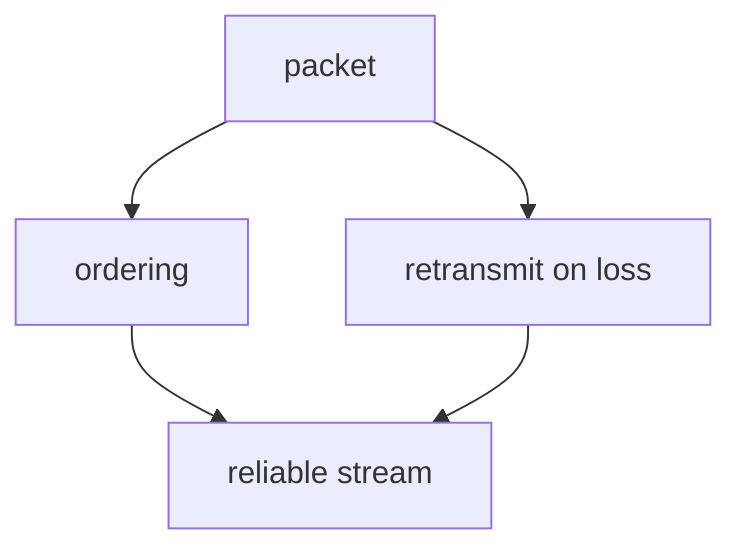

# Review

The `teach` skill builds the graph. This skill is what makes it stay.

**Why this exists as a separate skill:** the check immediately after teaching tests whether an explanation was *followed*. It does not test retention — at a five-minute delay, restudying beats testing outright. The testing effect only appears at ≥1 day (g = 0.41 at ≥1 day, 0.69 at ≥7 days). And spacing versus massing is g = 0.74, one of the two largest levers available. Both effects live here, not in the teaching session.

So: **a node is not known until it survives a cold re-test at a delay.**

---

## The state file

One per topic: `knowledge/<topic-slug>.md`.

````markdown
# <Topic>

**Goal:** <what he wants to be able to do/explain, from Phase 1b>
**Retention horizon:** <e.g. permanent / exam 2026-11-14 / conversation next week>
**Last session:** 2026-08-25

## Graph



## Nodes

| Node | Status | Last tested | Due | Notes |
|---|---|---|---|---|
| packet | [x] | 2026-09-01 | 2026-09-22 | survived cold re-test |
| ordering | [~] | 2026-08-25 | 2026-08-26 | landed, unverified |
| retransmit | [!] | 2026-08-25 | 2026-08-26 | see misconception 1 |
| reliable stream | [ ] | — | — | not taught yet |

Status key:
- `[ ]` not taught
- `[~]` landed — passed the immediate check only. **Not knowledge yet.**
- `[x]` verified — survived a cold re-test at ≥1 day
- `[!]` misconception outstanding

## Misconceptions

1. **retransmit** — "the network resends it automatically if it goes missing" (confident, context: asked what happens when a packet is dropped, 2026-08-25). Status: refuted 2026-08-25, needs re-probe in a different context.

## Frontier

- <strand>: has <X>, breaks at <Y>
````

Keep it terse. This is state, not prose — the readable narrative lives in `lessons/`.

---

## Scheduling

**+1 day → +1 week → +3 weeks.** Uniform gaps. Then retire the node, or push to +3 months if the horizon is long.

Do **not** build an expanding-interval schedule or an SM-2 clone. Expanding versus uniform intervals is g = 0.034, non-significant — it is the most oversold idea in consumer spaced repetition and it buys nothing over a flat ladder. Complexity here is pure cost.

Adjust only for his stated horizon:
- **Exam / event on a date** — fit the ladder inside the window; final review 1–3 days before, not the day before.
- **Permanent** — full ladder, then +3 months.
- **Conversation next week** — one review at +1 day and one the day before. That's it.

**On a failed node, reset to +1 day.** No fractional ease factors.

---

## Running a review

### 1. Pull what's due

Read every `knowledge/*.md`, collect nodes whose **Due** date is ≤ today, plus every `[~]` older than a day and every outstanding `[!]`.

If nothing is due, say so and offer either an early review or a new topic. Don't manufacture work.

### 2. Test cold — this is the whole point

**Do not re-teach first.** Do not summarise what he learned last time. Do not give a warm-up. Any of those convert a retrieval test into a restudy session and destroy the effect you came for.

Open straight into the question. If he's forgotten it entirely, *that is the information you came for* — and the correction that follows is worth more than the pre-emptive reminder would have been.

### 3. Ask properly

Full three-tier items — read `../teach/reference/quiz-design.md`. Do not shortcut them because it's "just a review"; the confidence tier is exactly how you tell a decayed memory from a re-emerged misconception, and those need different responses.

**Vary the surface form from how it was taught.** Same node, different framing, different numbers, different scenario. Testing it in the original wording measures recognition of your phrasing, not the idea. This matters most for `[!]` nodes — misconceptions are context-indexed, so a re-probe in the *original* context proves nothing.

Cap it at ~5–7 items per sitting.

### 4. Grade immediately, then route

Grade opens the very next message, always. Then route on confidence exactly as in `../teach/reference/misconceptions.md` — confident-wrong gets refutation, guessing-wrong gets plain teaching.

If a node fails and the *reason* is that a prerequisite has decayed, walk down the graph and test the prerequisite too. That's what the DAG is for.

### 5. Interleave — but only confusable siblings

Mix items from **nodes that are genuinely confusable with each other** — sibling concepts in the same graph that he could plausibly mix up. That's where interleaving pays.

Do **not** interleave unrelated topics for the sake of it. Interleaving is not a general-purpose good: on expository text it's non-significant, and on word learning it's **g = −0.39**, actively harmful. The benefit comes specifically from being forced to *discriminate* between similar things. No similarity, no benefit.

### 6. Update state

Rewrite the node rows: status, last tested, new due date. Add any new misconception in his phrasing with its context. Update the frontier lines if the review moved them.

Do this before ending the session, not from memory later.

### 7. Log activity and refresh the dashboard

Append one line to `knowledge/_activity.jsonl` (date, topic slug, `"type":"review"`, and interactions = count of `AskUserQuestion` calls this session), then regenerate and republish the dashboard — see **Dashboard** in `CLAUDE.md`.

---

## What not to do

- **Don't optimise for how it felt.** He will rate the easier, more fluent session as more effective. It isn't — learners systematically misjudge this, preferring restudy while performing worse on the delayed test. Believe the delayed test.
- **Don't soften a forgotten node.** "You probably just need a reminder" removes the dissatisfaction that makes the correction stick.
- **Don't skip the confidence tier** to save time. It's one line, and without it a lucky guess is recorded as mastery.
- **Don't promote a node to `[x]` on a same-day pass.** The delay is the mechanism.
