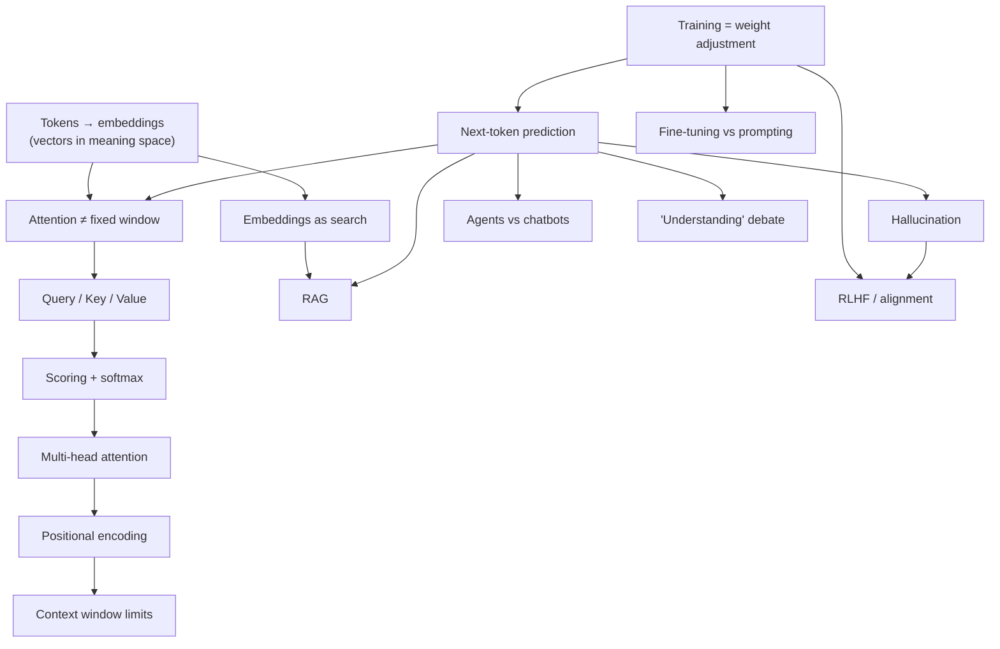

# LLMs — how they work / professional AI fluency

Goal: general professional fluency — correct, confident understanding to discuss AI intelligently in work contexts (meetings, product discussions, casual job-interview-adjacent conversation). Not a deep ML-engineering interview.

Retention horizon: **permanent** — standard spacing (+1 day, +1 week, +3 weeks).

## Review queue

- **2026-08-28** (+1 day) — cold-test all `[~]` nodes below, in fresh framings: ntp, hall, ft, win, qkv, score, mh, pos
- **2026-09-03** (+1 week)
- **2026-09-17** (+3 weeks)

Run `/review llms` when due.

## Dependency map

## Node status

- [x] train — training = adjusting billions of weights by nudging on gap between predicted/actual next token, over huge data (2026-08-27, confident + correct reason)
- [~] ntp — next-token prediction; repaired from a "search stored text" misconception mid-session, then correctly applied to hallucination immediately after. Not yet cold-verified across a delay.
- [~] hall — hallucination = plausible next-token prediction has no built-in truth-check; correct + correct reason + fairly sure, but demonstrated in the same session as the ntp repair — needs a delayed, differently-framed re-check.
- [~] ft — fine-tuning (more weight updates on task data) vs prompting (frozen weights, input-only): correct + correct reasoning in TWO independently-framed checks now (initial probe, and a fresh "lost prompt template" operational scenario 2026-08-27), but self-reported confidence stayed low both times ("just guessing" / "guesstimating"). Real evidence of understanding despite low confidence — flagged for a fresh cold check at +1 day review rather than a third same-session re-probe.
- [x] tok — solid (2026-08-27, confident + correct reason): tokens become vectors in a learned "meaning space" so similar-usage words land near each other, letting learning transfer between neighbors.
- [~] win — landed (2026-08-27): self-attention compares every token against every other token in one computation, no window, no distance penalty. Taught expository (he flagged discovery mode wasn't landing) — correct + certain on landing check, not yet cold-verified.
- [~] qkv — landed (2026-08-27): each token produces Query/Key/Value vectors because relevance ≠ raw similarity (e.g. "it"/"animal"). Correct + correct reason + fairly sure, not yet cold-verified.
- [~] score — landed (2026-08-27): Query·Key dot product → softmax → attention weights → weighted average of Value vectors. Correct + fairly sure, not yet cold-verified.
- [~] mh — landed (2026-08-27): several parallel Q/K/V attention computations ("heads"), each able to specialize on a different relationship type, outputs combined. Correct + fairly sure, not yet cold-verified.
- [~] pos — landed (2026-08-27): unique positional fingerprint added to each token's vector before attention runs, since attention alone is order-blind. Correct + fairly sure, not yet cold-verified.
- [ ] rag, emb, agent, ctx, rlhf, und — scoped for later sessions, not today. See researcher brief in session log for misconception distractors when these are taught.

## Misconceptions log

- [!] ntp — "LLMs generate text by searching stored text for a matching passage" (fairly sure, context: first probe of the session, asked directly "what is an LLM fundamentally doing when it generates text"). Refuted via bridging from his own correct tier-2 answer (token-probability sampling). Re-probe in a different surface context at the +1 day review — do NOT reuse the same "what is it doing" framing.

## Future-session material (from researcher brief, 2026-08-27)

For when rag/emb/agent/ctx/rlhf/und are taught, key misconceptions to use as distractors:
- RAG: "RAG is basically pasting the whole doc into the prompt" / "custom knowledge always requires fine-tuning a model"
- Embeddings: "semantic search is just fancier keyword search" / "an embedding is a compressed version of the text, like a zip file or hash"
- Agents: "AI agent is just marketing for a chatbot with a nicer UI" (nuanced — the distinction is real, but the term is also overused; only ~130 of thousands of self-described agent vendors are verifiably agentic per Gartner, cited secondhand — unverified primary source)
- Context window: "bigger context window = model reads/weighs it all equally, like a person" — wrong, see "lost in the middle" effect
- RLHF: "RLHF makes the model honest / fixes hallucination" — wrong, RLHF optimizes toward human-preferred fluent/confident output via a reward model, which is a separate axis from truth-checking; ties back to [[hall]] node
- Understanding debate: stochastic-parrots vs. interpretability-findings is a genuinely live, unresolved expert debate — teach as calibration/intellectual honesty, not a flashcard answer

Also flagged as must-know-but-shallow: prompt→context engineering shift, scaling laws (term only), benchmark contamination (term only). Not full nodes — one-sentence mentions when relevant.

Gaps to verify before teaching: open vs. closed models landscape (2026 specifics not researched), current capabilities/limitations snapshot (short half-life, research close to when taught).
