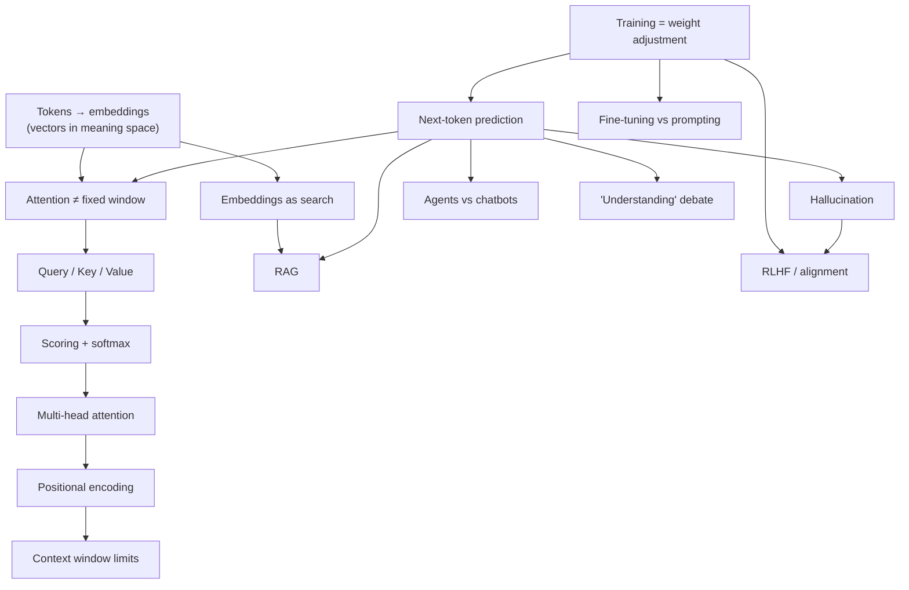

# LLMs — how they work / professional AI fluency

Goal: general professional fluency — correct, confident understanding to discuss AI intelligently in work contexts (meetings, product discussions, casual job-interview-adjacent conversation). Not a deep ML-engineering interview.

Retention horizon: **permanent** — standard spacing (+1 day, +1 week, +3 weeks).

## Review queue

- **2026-09-01** — cold re-test (fresh framings again): ntp, hall, win, qkv, score, pos
- **2026-09-07** (+1 week) — ft, mh (both verified 2026-08-31, first clean delayed pass)
- **2026-09-17** (+3 weeks) — carries forward for whatever is `[x]` by then

Run `/review llms` when due.

## Dependency map

## Node status

- [x] train — training = adjusting billions of weights by nudging on gap between predicted/actual next token, over huge data (2026-08-27, confident + correct reason)
- [~] ntp — cold-tested 2026-08-31 (new framing: "novel sentence ⇒ must be recombination" scenario). Correct + correct reasoning again, but self-reported "just guessing" — second time confidence hasn't matched accuracy. Not credited yet. Due 2026-09-01.
- [!] hall — cold-tested 2026-08-31 in a fresh context (fake-citation scenario). Answered "model has a trained incentive to avoid blank answers" — confident (fairly sure), wrong: a **motivation-based misconception**, distinct from the original "search stored text" one. Refuted via bridging from his own correct ntp mechanism (no separate truth-check step exists in token-by-token generation). Due 2026-09-01, different context again.
- [x] ft — **verified 2026-08-31**: third independently-framed check (JSON-schema support-bot scenario), correct + correct reasoning + **certain** for the first time (prior two passes were correct but low-confidence). Fine-tuning = permanent weight change; prompting = frozen weights, repeated per call. Next check 2026-09-07 (+1 week).
- [x] tok — solid (2026-08-27, confident + correct reason): tokens become vectors in a learned "meaning space" so similar-usage words land near each other, letting learning transfer between neighbors.
- [~] win — cold-tested 2026-08-31 (sliding-window claim scenario). Tier 1 correct (no window; PE ≠ distance penalty) but tier 2 wrong — picked "PE directly penalizes distant scores," a distinct distractor from how it was taught. Treated as a miss despite right answer; retaught the actual mechanism (attention = all-pairs dot product in one step; PE only carries order, not distance). Due 2026-09-01.
- [~] qkv — cold-tested 2026-08-31 (pronoun-resolution scenario, "The trophy didn't fit in the suitcase..."). Correct + correct reasoning, but "just guessing" — same guess-despite-correct pattern as ntp. Due 2026-09-01.
- [~] score — cold-tested 2026-08-31, but surfaced a **prerequisite gap first**: he didn't know what softmax itself was (asked directly, mid-quiz, before attempting the question). Taught softmax inline (exponentiate + normalize to a distribution summing to 1) — he then answered the actual diagnostic correctly + correct reasoning + certain, but that doesn't count as a cold pass since it immediately followed the explanation in the same message exchange. Needs a genuine cold re-check. Due 2026-09-01.
- [x] mh — **verified 2026-08-31**: first cold check (taught 2026-08-27, 4-day delay), fresh framing ("why not one big head instead of several"). Correct + correct reasoning + fairly sure. Next check 2026-09-07 (+1 week).
- [!] pos — cold-tested 2026-08-31 (word-shuffle scenario). Tier 2 was right (attention itself is a set operation, order-blind) but tier 1 was wrong: believed positional encoding actively *restores/re-sorts* scrambled input back to original order, rather than just blindly tagging whatever token lands in each slot. Confident (fairly sure) → genuine misconception, refuted. Due 2026-09-01, different context again.
- [ ] rag, emb, agent, ctx, rlhf, und — scoped for later sessions, not today. See researcher brief in session log for misconception distractors when these are taught.

## Misconceptions log

- [x] ntp (original) — "LLMs generate text by searching stored text for a matching passage" (fairly sure, context: first probe of the session, asked directly "what is an LLM fundamentally doing when it generates text"). Refuted 2026-08-27. Re-probed 2026-08-31 in a completely different framing (novel-sentence scenario) — did **not** recur; he answered correctly (though as a low-confidence guess). This specific misconception looks resolved; ntp node itself still open pending a confidence-matched pass.
- [!] hall — "the model has a trained incentive/policy to avoid blank answers, so it invents plausible details rather than a truth-check failing" (fairly sure, context: fake-citation cold re-test, 2026-08-31). A motivation-based misconception, distinct from the ntp one. Refuted by bridging from his own correct ntp mechanism — if it were a policy, explicit "say I don't know" instructions would mostly fix it, and they don't; the real gap is structural (no verification step anywhere in generation). Re-probe in a different context again.
- [!] pos — "positional encoding actively restores/re-sorts a shuffled sequence back to its original order" (fairly sure, context: word-shuffle cold re-test, 2026-08-31). He correctly held that attention itself is order-blind (tier 2 right) but wrongly modeled PE as a correction step rather than blind per-slot tagging. Refuted 2026-08-31. Re-probe in a different context.

## Future-session material (from researcher brief, 2026-08-27)

For when rag/emb/agent/ctx/rlhf/und are taught, key misconceptions to use as distractors:
- RAG: "RAG is basically pasting the whole doc into the prompt" / "custom knowledge always requires fine-tuning a model"
- Embeddings: "semantic search is just fancier keyword search" / "an embedding is a compressed version of the text, like a zip file or hash"
- Agents: "AI agent is just marketing for a chatbot with a nicer UI" (nuanced — the distinction is real, but the term is also overused; only ~130 of thousands of self-described agent vendors are verifiably agentic per Gartner, cited secondhand — unverified primary source)
- Context window: "bigger context window = model reads/weighs it all equally, like a person" — wrong, see "lost in the middle" effect
- RLHF: "RLHF makes the model honest / fixes hallucination" — wrong, RLHF optimizes toward human-preferred fluent/confident output via a reward model, which is a separate axis from truth-checking; ties back to [[hall]] node
- Understanding debate: stochastic-parrots vs. interpretability-findings is a genuinely live, unresolved expert debate — teach as calibration/intellectual honesty, not a flashcard answer

Also flagged as must-know-but-shallow: prompt→context engineering shift, scaling laws (term only), benchmark contamination (term only). Not full nodes — one-sentence mentions when relevant.

Gaps to verify before teaching: open vs. closed models landscape (2026 specifics not researched), current capabilities/limitations snapshot (short half-life, research close to when taught).
