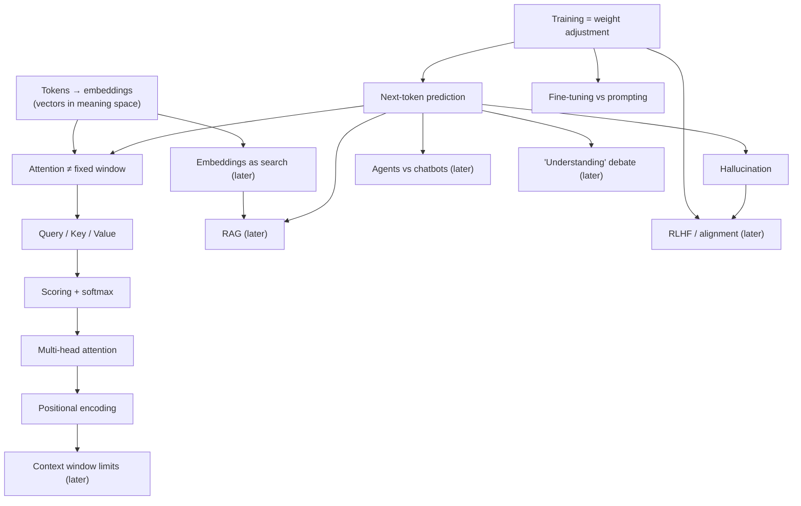

# LLMs — how they work (2026-08-27)

**Goal:** general professional fluency about AI/LLMs — correct, confident understanding for work conversations and job contexts, not a deep ML-engineering interview. Retention horizon: permanent (+1 day, +1 week, +3 weeks review).

## Where we started (probing)

Five three-tier probes located the frontier:

1. **Generation mechanism** — initially answered "searches stored text for a match" (wrong) but picked the correct reasoning ("computes token probabilities and samples") for *why*. Refuted: a lookup process can't produce sentences that never existed in training data (novel analogies, bug fixes for code just written), but next-token sampling can. He then correctly re-derived the mechanism.
2. **Training** — correctly identified training as adjusting billions of internal weights based on the gap between predicted and actual next token, repeated across huge amounts of text. Solid, confident.
3. **Hallucination** — correctly derived that hallucination follows directly from next-token prediction having no built-in truth-check (plausible ≠ true). Correct, fairly confident.
4. **Self-attention** — guessed it's a fixed nearby window. Wrong, and a pure guess (no prior belief to unwind) — this is the real frontier for today.
5. **Fine-tuning vs. prompting** — correctly said fine-tuning adjusts weights on task data while prompting only changes input to a frozen model, but flagged himself as guessing — right answer, no confidence yet.

## Today's plan

Build the transformer/self-attention chain from scratch (the located frontier), then solidify fine-tuning vs. prompting. Practical landscape topics (RAG, embeddings-as-search, agents, context windows, RLHF, the "understanding" debate) are scoped into the full map for later sessions — see `knowledge/llms.md`.

## Teaching

### Node: tokens → embeddings

**Motivation.** A neural network is just arithmetic. A sentence is words. So the first thing that has to happen to any text is: turn it into numbers.

**Discovery.** Posed: if every word got an arbitrary ID (`cat=402`, `dog=403`, `umbrella=9931`), what breaks? He correctly reasoned: nothing meaningful transfers — the network would have no way to know "cat" and "dog" are related just from 402/403, and would have to learn every word from scratch in isolation.

**Established.** Instead of one arbitrary ID, each token becomes a **vector** — a list of hundreds/thousands of numbers, a coordinate in a learned high-dimensional space. The space is trained so words used in similar contexts land near each other: "cat" and "dog" close, "cat" and "umbrella" far. This is an **embedding**. Payoff: what the model learns about "dog" partially transfers to "cat" automatically, because they're geometric neighbors. Attention (next) operates on these vectors, not on words.

**Landing check:** Why do "cat"/"dog" end up close and "cat"/"umbrella" far? → *Trained so similar-usage words are close.* Correct, Certain. **[x] solid.**

### Node: self-attention ≠ fixed window

**Motivation.** Example: *"The animal didn't cross the street because it was too tired."* To resolve "it" → "animal," the model must connect words six positions apart. Older RNN architectures read strictly word-by-word, so information degraded over that distance. This is the actual problem self-attention exists to solve.

**Discovery attempt.** Posed whether a 3-word sliding window could ever reach "animal." He answered "yes, it would slide over eventually" but flagged he didn't yet have the concept to reason about it — correctly self-identified as not ready for discovery mode here, so switched to direct exposition.

**Established.** Self-attention compares every token against *every other token in the sentence, in one single computation* — no window, no sliding, no distance penalty. "it" connects directly to "animal" in one shot, the same as every other pair in the sentence. This is the actual fix for the RNN problem: no intermediate steps to degrade through.

**Landing check:** How far away can a word be and still directly influence another? → *Any distance — no penalty at all.* Correct, Certain. **[~] landed, not yet cold-verified.**

### Node: Query / Key / Value

**Motivation.** Attention compares every token pair — but how? Raw embedding similarity can't be the mechanism: "it" and "animal" need to attend strongly to each other despite being dissimilar as words (pronoun vs. noun).

**Established.** Each token produces three learned vectors: Query ("what am I looking for"), Key ("what do I offer"), Value ("what I actually hand over"). Card-catalog analogy: Query = search terms, Key = what's on the catalog card, Value = the actual book retrieved. Decouples "what a token is like" from "what it's relevant to" — so "it" can learn to query for things like "a tireable physical entity" and "animal" can learn to advertise exactly that as its Key, despite looking nothing alike as raw words.

**Landing check:** Why three separate vectors instead of direct embedding comparison? → *Relevance differs from raw similarity.* Correct, Fairly sure. **[~] landed, not yet cold-verified.**

### Node: scoring + softmax

**Motivation.** Query/Key give match scores — but real sentences often need a word to draw on more than one other word at once. Discovery: should the model keep only the top match, or blend? He correctly reasoned: blend, weighted by score.

**Established.** Query·Key dot product gives a raw score per word pair. Softmax converts raw scores into proportions (positive, sum to 1) — the attention weights. The model then computes a weighted average of every word's *Value* vector using those weights. Nothing discarded; everything contributes proportional to relevance.

**Landing check:** What does the model compute using the weights? → *A weighted average of Value vectors.* Correct, Fairly sure. **[~] landed, not yet cold-verified.**

### Node: multi-head attention

**Motivation.** A sentence has many simultaneous relationship types (grammar, coreference, topic). Discovery: could one Query vector handle all of them at once? He correctly reasoned: it would compromise on all of them, like one search query trying to satisfy several intents.

**Established.** Transformers run several attention computations in parallel ("heads," e.g. 8–~100 depending on model size), each with its own separately learned Q/K/V projections, letting each specialize (grammar, coreference, topic, etc.). Outputs combined into one final per-token representation.

**Landing check:** What does "multi-head" mean? → *Several parallel attention computations.* Correct, Fairly sure. **[~] landed, not yet cold-verified.**

### Node: positional encoding

**Motivation.** Attention as built compares every word to every other regardless of order. Discovery: could it tell "dog bites man" from "man bites dog" (same words) as described so far? He correctly reasoned: no, nothing marks position yet.

**Established.** Each token gets a unique numeric "fingerprint" added to its vector based on its position before attention runs. Position becomes part of what Queries/Keys compare, not just word identity — restoring order-sensitivity to an otherwise order-blind mechanism.

**Landing check:** Why is positional encoding needed? → *Attention alone has no sense of order.* Correct, Fairly sure. **[~] landed, not yet cold-verified.**

**Chain complete: tokens → embeddings → attention (window, QKV, scoring/softmax, multi-head) → positional encoding. This is the full transformer self-attention mechanism, taught from scratch.**

### Solidifying: fine-tuning vs. prompting

Reconnected to the already-solid training root (fine-tuning = literally more of the same weight-adjustment process, on task-specific data; prompting never runs that process at all). Re-probed in a fresh operational framing: two teams adapt a model to a company style, one fine-tunes, one only prompts; the prompt template is later lost — what happens to the prompt-only team's model?

Answered correctly again — "reverts to generic behavior," "prompting never touches weights" — but self-reported confidence as "guesstimating." Two independently-framed correct answers with correct reasoning is real evidence of understanding, not a coincidence of guessing twice. Flagged for a fresh check at the delayed review rather than a third same-session re-probe (diminishing returns / fatigue risk).

## Close-out

**Today's session covered:** tokens→embeddings, self-attention (window correction, Query/Key/Value, scoring/softmax, multi-head), positional encoding — the full transformer mechanism, from scratch — plus reinforcing fine-tuning vs. prompting.

**Review schedule (standard spacing, permanent-retention goal):**
- **+1 day** — 2026-08-28
- **+1 week** — 2026-09-03
- **+3 weeks** — 2026-09-17

Run `/review llms` when due. The review will cold-test (in fresh framings, not the ones used here) every `[~]` node above: tokens→embeddings is already `[x]` solid; everything else taught today is `[~]` and needs to survive a delayed, differently-framed retest before it earns `[x]`.

**Next session's material** (already mapped in `knowledge/llms.md`, not yet taught): RAG, embeddings-as-search, agents vs. chatbots, context window limits, RLHF/alignment, and the live "do LLMs understand anything" debate — the professional-landscape half of the topic.
